# Entity-Relationship Diagram

```mermaid
erDiagram
    %% ==============================
    %% CORE ENTITIES
    %% ==============================
    organizations {
        uuid id PK
        string name
        enum org_type
        text address
        string phone
        string email
        string license_number
        string tax_id
        string website
        bool is_active
        datetime created_at
        datetime updated_at
    }

    hospitals {
        uuid id PK
        string name
        string address
        string phone
        string email UK
        string license_number UK
        enum hospital_type
        bool is_active
        bool is_deleted
        datetime deleted_at
        uuid deleted_by_id FK
        int version
        uuid created_by_id FK
        uuid updated_by_id FK
        string fhir_resource_type
        string fhir_id
        datetime created_at
        datetime updated_at
    }

    departments {
        uuid id PK
        string name
        text description
        uuid hospital_id FK
        bool is_active
        datetime created_at
        datetime updated_at
    }

    users {
        uuid id PK
        string email UK
        string hashed_password
        string full_name
        enum role
        string phone
        string firebase_uid
        string profile_image_url
        bool is_active
        bool is_email_verified
        bool is_phone_verified
        bool is_mfa_enabled
        string mfa_secret
        uuid hospital_id FK
        datetime last_login_at
        datetime last_password_change
        json password_history
        int login_attempts
        datetime locked_until
        bool is_deleted
        datetime deleted_at
        uuid deleted_by_id FK
        int version
        datetime created_at
        datetime updated_at
    }

    patients {
        uuid id PK
        string mrn UK
        string full_name
        date date_of_birth
        enum gender
        string national_id UK
        string phone
        string email
        string emergency_contact_name
        string emergency_contact_phone
        string emergency_contact_relation
        enum blood_type
        text allergies
        text medical_conditions
        text medications
        float height_cm
        float weight_kg
        bool is_ihd_suspected
        datetime admission_date
        datetime discharge_date
        uuid department_id FK
        string bed_number
        uuid hospital_id FK
        bool is_active
        bool is_deleted
        datetime deleted_at
        uuid deleted_by_id FK
        int version
        uuid created_by_id FK
        uuid updated_by_id FK
        string fhir_resource_type
        string fhir_id
        string icd10_code
        string snomed_ct_code
        string loinc_code
        datetime created_at
        datetime updated_at
    }

    %% ==============================
    %% DEVICE & MONITORING
    %% ==============================
    devices {
        uuid id PK
        string device_name
        enum device_type
        string serial_number UK
        string mac_address UK
        string firmware_version
        string sim_iccid
        uuid hospital_id FK
        uuid patient_id FK
        enum status
        float battery_level
        float signal_strength
        datetime last_seen
        bool is_active
        bool is_deleted
        datetime deleted_at
        uuid deleted_by_id FK
        int version
        uuid created_by_id FK
        uuid updated_by_id FK
        string fhir_resource_type
        string fhir_id
        datetime created_at
        datetime updated_at
    }

    sensor_readings {
        uuid id PK
        uuid patient_id FK
        uuid device_id FK
        datetime timestamp
        float ir_value
        float red_value
        float spo2
        float heart_rate
        float rso2
        float signal_quality
        float motion_artifact
        float risk_score
        enum risk_level
        bool processed_by_tinyml
        bool processed_by_cloud
        string fhir_resource_type
        string fhir_id
        string icd10_code
        string snomed_ct_code
        string loinc_code
        datetime created_at
    }

    alerts {
        uuid id PK
        uuid patient_id FK
        uuid device_id FK
        uuid sensor_reading_id FK
        enum alert_type
        enum severity
        float risk_score
        text message
        bool is_acknowledged
        uuid acknowledged_by FK
        datetime acknowledged_at
        bool is_resolved
        uuid resolved_by FK
        datetime resolved_at
        text resolution_notes
        json extra_data
        bool is_deleted
        datetime deleted_at
        uuid deleted_by_id FK
        int version
        string fhir_resource_type
        string fhir_id
        string icd10_code
        string snomed_ct_code
        string loinc_code
        datetime created_at
        datetime updated_at
    }

    %% ==============================
    %% AI & KNOWLEDGE
    %% ==============================
    ai_reports {
        uuid id PK
        uuid patient_id FK
        uuid alert_id FK
        enum report_type
        float risk_score
        float confidence
        string bleeding_type
        enum icp_risk
        enum herniation_risk
        text summary
        text detailed_analysis
        text recommendations
        json features
        string model_version
        json input_data
        json raw_output
        uuid reviewed_by FK
        datetime reviewed_at
        bool is_reviewed
        bool is_deleted
        datetime deleted_at
        uuid deleted_by_id FK
        int version
        uuid created_by_id FK
        uuid updated_by_id FK
        string fhir_resource_type
        string fhir_id
        string icd10_code
        string snomed_ct_code
        string loinc_code
        datetime created_at
        datetime updated_at
    }

    knowledge_base {
        uuid id PK
        string title
        text content
        string source
        string category
        json tags
        json embedding
        bool is_published
        bool is_deleted
        datetime deleted_at
        uuid deleted_by_id FK
        int version
        uuid created_by_id FK
        uuid updated_by_id FK
        string fhir_resource_type
        string fhir_id
        datetime created_at
        datetime updated_at
    }

    knowledge_update_logs {
        uuid id PK
        uuid knowledge_id FK
        enum action
        string source
        text notes
        uuid performed_by FK
        json changes
        datetime created_at
        datetime updated_at
    }

    %% ==============================
    %% AUDIT
    %% ==============================
    audit_logs {
        uuid id PK
        uuid user_id
        string action
        string resource
        string resource_id
        json details
        string ip_address
        string user_agent
        string correlation_id
        datetime created_at
        datetime updated_at
    }

    %% ==============================
    %% AUTH & RBAC
    %% ==============================
    roles {
        uuid id PK
        string name UK
        text description
        bool is_system
        datetime created_at
        datetime updated_at
    }

    permissions {
        uuid id PK
        string codename UK
        string name
        text description
        string resource
        datetime created_at
    }

    sessions {
        uuid id PK
        uuid user_id FK
        string token_hash
        string refresh_token_hash
        string ip_address
        text user_agent
        string device_info
        bool is_active
        datetime expires_at
        datetime created_at
        datetime last_activity_at
    }

    refresh_tokens {
        uuid id PK
        uuid user_id FK
        string token_hash
        string device_info
        string ip_address
        bool is_revoked
        datetime revoked_at
        datetime expires_at
        datetime created_at
    }

    %% ==============================
    %% ASSOCIATION TABLES
    %% ==============================
    user_roles {
        uuid user_id FK
        uuid role_id FK
        datetime created_at
    }

    role_permissions {
        uuid role_id FK
        uuid permission_id FK
        datetime created_at
    }

    %% ==============================
    %% RELATIONSHIPS
    %% ==============================
    %% User
    users ||--o{ sessions : "has"
    users ||--o{ refresh_tokens : "has"
    users ||--o{ user_roles : "has"
    users }o--|| hospitals : "belongs_to"

    %% Hospital
    hospitals ||--o{ departments : "contains"
    hospitals ||--o{ users : "employs"
    hospitals ||--o{ patients : "admits"

    %% Patient
    patients ||--o{ sensor_readings : "generates"
    patients ||--o{ alerts : "triggers"
    patients ||--o{ ai_reports : "has"
    patients |o--|| devices : "assigned_to"
    patients }o--|| hospitals : "registered_at"
    patients }o--|| departments : "assigned_to"

    %% Device
    devices ||--o{ sensor_readings : "produces"
    devices |o--|| patients : "assigned_to"
    devices }o--|| hospitals : "owned_by"

    %% Alert M2M
    alerts ||--|| patients : "for"
    alerts }o--|| devices : "from"
    alerts }o--|| sensor_readings : "based_on"

    %% AI Report
    ai_reports ||--|| patients : "for"
    ai_reports }o--|| alerts : "triggered_by"

    %% Knowledge
    knowledge_base ||--o{ knowledge_update_logs : "tracks"

    %% RBAC M2M
    user_roles }o--|| users : "references"
    user_roles }o--|| roles : "references"
    role_permissions }o--|| roles : "references"
    role_permissions }o--|| permissions : "references"

    %% Org structure
    departments }o--|| hospitals : "part_of"
```

## Cardinality Legend

| Symbol | Meaning |
|--------|---------|
| `||--||` | One-to-One |
| `||--o{` | One-to-Many |
| `}o--||` | Many-to-One |
| `}o--o{` | Many-to-Many |

## Cascade Rules

| Parent | Child | On Delete |
|--------|-------|-----------|
| Hospital | Patient | CASCADE |
| Hospital | Department | CASCADE |
| Patient | SensorReading | CASCADE |
| Patient | Alert | CASCADE |
| Patient | AIReport | CASCADE |
| User | Session | CASCADE |
| User | RefreshToken | CASCADE |
| User | UserRole | CASCADE |
| Role | UserRole | CASCADE |
| Role | RolePermission | CASCADE |
| Permission | RolePermission | CASCADE |
| KnowledgeBase | KnowledgeUpdateLog | CASCADE |
| Hospital | Device | SET NULL |
| Hospital | User | SET NULL |
| Device | SensorReading | SET NULL |
| Device | Alert | SET NULL |
| Alert | AIReport | SET NULL |
| User | Alert (acknowledged_by/resolved_by) | SET NULL |
| User | KnowledgeUpdateLog (performed_by) | SET NULL |
| User | AuditLog | NO ACTION (keep history) |
| Patient | Device | SET NULL |
